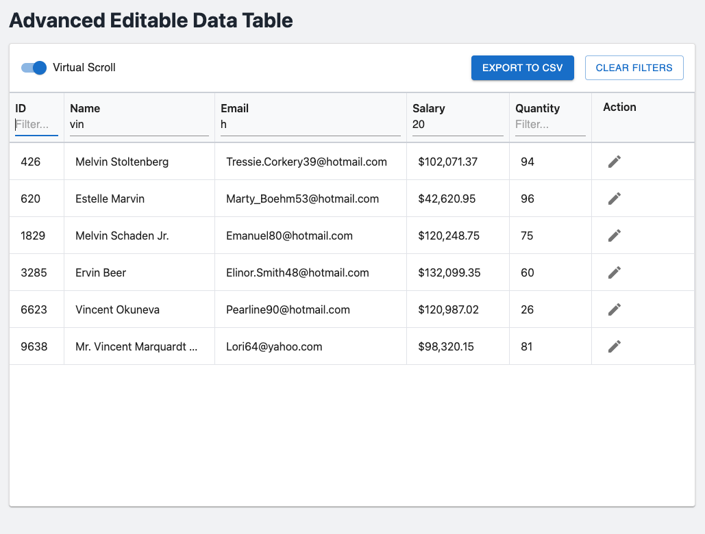
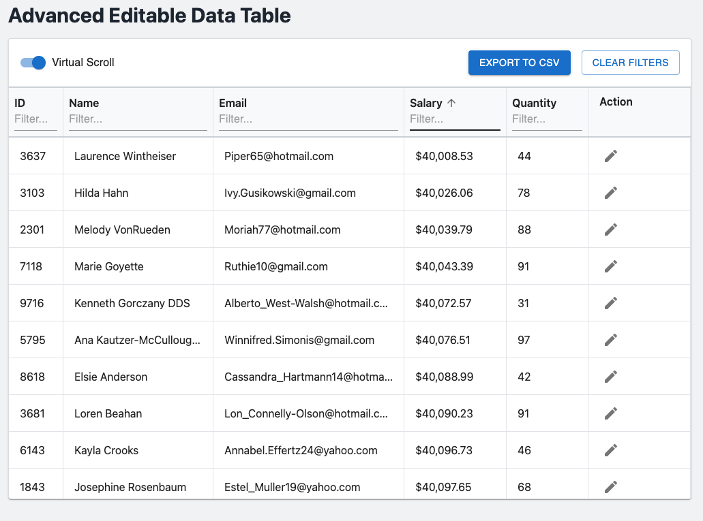
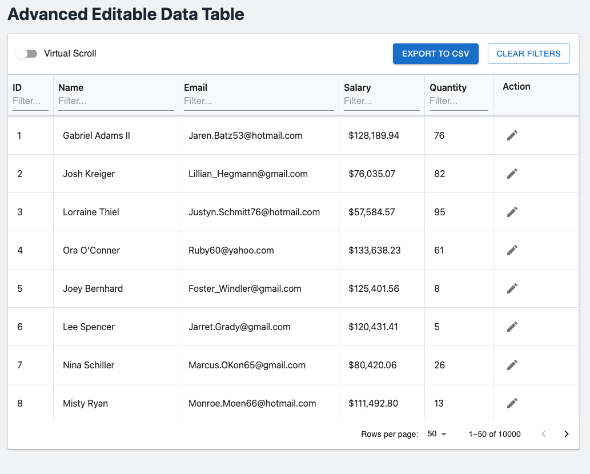
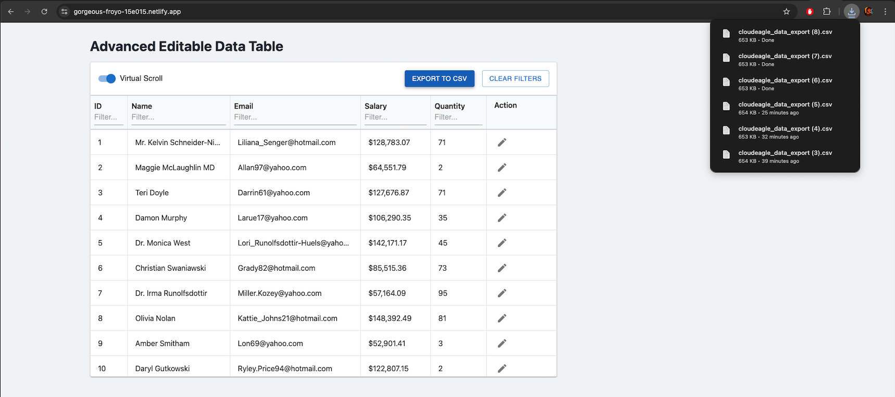
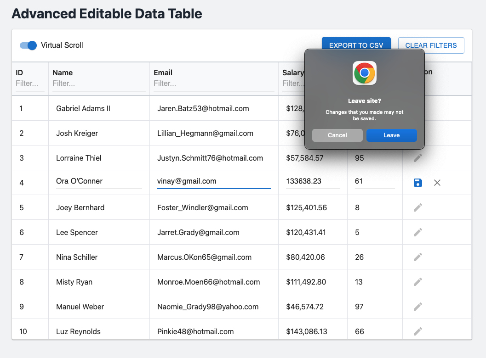

# Advanced Editable Data Table - CloudEagle Assignment

This project is a high-performance, data-intensive, and editable table component built in React. It is designed to handle large datasets (10,000+ rows) efficiently while providing a rich, user-friendly interface. This application fulfills all core, optional, and bonus requirements of the CloudEagle Frontend Technical Task.

---

## 🎥 Live Demo & Video Walkthrough

- **Live Application:** [https://gorgeous-froyo-15e015.netlify.app/](https://gorgeous-froyo-15e015.netlify.app/)
- **Video Walkthrough:** [https://drive.google.com/file/d/1OnpvA4kpgt71e_oA0FcnJFE1wTeSvJ3t/view?usp=sharing](https://drive.google.com/file/d/1OnpvA4kpgt71e_oA0FcnJFE1wTeSvJ3t/view?usp=sharing)

---

## 📸 Screenshots

**Main Table View**
_Main table view with sorting and filtering enabled._




---

**Editing a Row**
_A row in inline-edit mode._


---

**Pagination View**
_The table in paginated view mode._



---

**CSV Export**
_Export to CSV functionality._



---

**Unsaved Changes Prompt**
_Browser prompt for unsaved changes._



---

## ✨ Features

This application includes a comprehensive set of features designed for a modern data grid:

- **Inline Editing:** Users can click "Edit" on any row to modify text and numeric fields directly within the table.
- **Save & Cancel Actions:** Each editable row has dedicated "Save" and "Cancel" buttons for a clear user workflow.
- **High-Performance Virtualization:** Built with **`react-window`** to ensure exceptional performance, rendering only the visible rows and maintaining a smooth scrolling experience even with 10,000+ records.
- **Pagination as a Fallback:** Users can switch to a traditional paginated view, providing a robust fallback and an alternative way to navigate the data.
- **Multi-Column Sorting:** All data columns can be sorted in both ascending and descending order. The UI provides clear visual indicators for the active sort column and direction.
- **Dynamic Filtering:** Each column includes a text-based filter, allowing users to instantly narrow down the dataset.
- **Clear Filters:** A dedicated "Clear Filters" button provides a one-click way to reset the view to the original dataset.
- **Export to CSV:** Users can export the currently filtered and sorted data to a CSV file at any time.
- **Track Unsaved Changes:** A browser prompt warns users if they attempt to leave the page with unsaved edits, preventing accidental data loss.
- **Centralized State Management:** The application's state is managed by a robust, predictable system using **React's Context API** and a `useReducer` hook.
- **Modular & Reusable Code:** The logic is cleanly separated into custom hooks (`useVirtualTable`) and reusable components (`TableRow`, `EditableCell`), following modern React best practices.
- **Responsive Design:** The table is fully responsive and provides a horizontal scrollbar on smaller screens to ensure all data is accessible.

---

## 🛠️ Tech Stack

- **Framework:** React (with Vite)
- **Language:** TypeScript
- **UI:** Custom components built with Tailwind CSS, with icons and components from Material-UI.
- **Virtualization:** `react-window`
- **State Management:** React Context API with `useReducer`
- **CSV Export:** `react-csv`
- **Data Generation:** `@faker-js/faker`

---

## 🚀 Setup and Installation

1.  **Node.js Version:** This project requires **Node.js v22.x** or higher.

2.  **Clone the repository:**

    ```bash
    git clone [https://github.com/vinaysolanki535/cloudeagle-coding-assignment](https://github.com/vinaysolanki535/cloudeagle-coding-assignment)
    ```

3.  **Navigate to the project directory:**

    ```bash
    cd cloudeagle-coding-assignment
    ```

4.  **Install dependencies:**

    ```bash
    npm install
    ```

5.  **Run the development server:**
    ```bash
    npm run dev
    ```
    The application will be available at `http://localhost:5173`.

---

## 🧠 Approach and Decisions

### 1. Custom Table Component for Maximum Control

For this data-intensive application, I made the strategic decision to build a **custom table component** using `div`s styled with Tailwind CSS, rather than relying on a pre-built component from a UI library. This approach offered several key advantages:

- **Guaranteed Performance:** It gave me complete control over the DOM structure, allowing for a seamless and highly optimized integration with the `react-window` virtualization library. This eliminates any potential performance bottlenecks or library conflicts.
- **Ultimate Flexibility:** A custom component provides the freedom to implement complex features like synchronized sticky headers, custom cell renderers, and fine-grained event handling without being constrained by a library's API.
- **Maintainability:** The resulting code is lean and specific to the project's needs, making it easier to understand, debug, and extend in the future.

### 2. Virtualization Strategy

The core requirement was to handle 10,000+ rows efficiently. `react-window` was chosen for this task due to its small bundle size and high performance. The final implementation uses a custom sticky header and a virtualized body, with a single scroll container managed by the browser. This is the most robust and performant method for creating a virtualized data grid.

### 3. State Management Architecture

For a data-intensive application like this, managing state effectively is crucial. I implemented a centralized state management pattern using **React's Context API and a `useReducer` hook**.

- **`TableContext.tsx`:** A reducer function handles all state transitions (sorting, filtering, editing, saving). This makes the state logic predictable and easy to debug.
- **`useVirtualTable.ts`:** This custom hook consumes the context and is responsible for memoizing the derived data (the filtered and sorted array that gets rendered).
- **Component Structure:** The main `DataTable` component is now a clean, presentational component that dispatches actions and displays data, while the complex logic is encapsulated in the context and hooks.

This architecture is highly scalable and adheres to modern React best practices.

---

## 🚧 Known Limitations

- **CSV Export Memory Usage:** The current CSV export functionality processes the entire filtered dataset in the browser. For extremely large datasets (e.g., 1,000,000+ rows), a server-side export solution would be more memory-efficient.
- **Single Row Editing:** The current implementation only allows one row to be in edit mode at a time. This is a deliberate UI/UX choice to simplify the user experience, but it could be expanded to support multi-row editing in the future.
